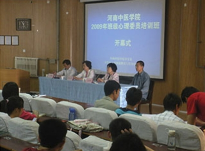
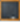

# zzy.github.io
个人网站
<!DOCTYPE html>
<html >

<head>
    <meta charset="UTF-8">
    <title>心理咨询首页</title>
</head>

<body bgcolor="#c2e7f0" >
    <table border="0" align="center" bgcolor="white">
    <!-- 第一行 -->
<tr>
    <td colspan="3"></td>
</tr>
<!-- 第二行 -->
<tr bgcolor="#ccc">
    <td colspan="3">
        <table >
            <tr>
                <td></td>
                <td><a href="#">首页|</a></td>
                <td><a href="#">中心概况|</a></td>
                <td><a href="#">中心动态|</a></td>
                <td><a href="#">心理常识|</a></td>
                <td><a href="#">心理调节|</a></td>
                <td><a href="#">联系我们</a></td>
            
            </tr>
        </table>
 <!-- 第三行 -->
 <tr >
    <td colspan="2" >
       <table border="1">
            <tr><td>今日导读 
   </td></tr>
         <td > </td>
             
                <td>
                    

<h5>2012-2013学年第二学期心理咨询安排</h5>为进一步加强我校大学生的心理辅导，更好的为广大同学服务...<详细>                      
                    <h5>从无所适从到乐观从容</h5>花开花落自有时，大自然总能把最美好的色彩恰到好处的调和出来... <详细>    
                    <h5>呵护心灵 畅想青春</h5>青春的岁月在我们指尖缓缓流，我们逐渐走向成熟。青春是我们最... <详细>
                </td>
                     
         </table>
    </td> 
    <!-- 第三行第三列 -->
<td bgcolor="#e3f4ff">
        <table border="0" rules="none" >
                <tr><td><pre></pre></td></tr>
                <tr><td> 中心动态 更多>>>
  </td></tr>
                <tr><td> 我校第七届大学生心理健康教育宣传月开幕</td>   </tr>
                <tr><td> 河南中医学院第七届心理健康教育宣传月...</td>  </tr>
                <tr><td> 2012-2013学年第一学期心理咨询时....</td>  </tr>
                <tr><td> 我校第六届大学生心理健康教育宣传月活动圆..</td>  </tr>
                <tr><td> 我校第六届大学生心理健康教育宣传月开幕..</td>  </tr>
                <tr><td> 2010-2011学年第二学期心理咨询时...</td>  </tr>
                <tr><td> 我校2010级新生心理测评工作圆满结束</td>  </tr>
                <tr><td><pre>   </pre></td></tr>
                <tr><td><pre>   </pre></td></tr>
        </table>
            
</tr>
            <!-- 第四行 -->
 <tr>
    <!-- 第1列 -->
     <td>
         <table>
             <td>
  <table>
            <tr><td>心理常识 更多 >>>
</td></tr>
            <tr><td> 巧识心理抑郁</td>   </tr>
            <tr><td> 人生需要放弃的八样东西</td>  </tr>
            <tr><td> 心理健康十项标准</td>  </tr>
            <tr><td> 什么是心里情绪健康</td>  </tr>
            <tr><td> 人际交往应该避免的三个问题</td>  </tr>
            <tr><td> 测测你是否心理健康</td>  </tr>
   </table>  
            </td>
   <!-- 第2列 -->
   <td >
<table >
             <tr><td>心理调节 更多 >>>
</td></tr>
             <tr><td> 运动法助你解压</td>   </tr>
             <tr><td> 自我心理调节的方法</td>  </tr>
             <tr><td> 维持心理平衡10要诀</td>  </tr>
             <tr><td> 7种心理缺陷运动治疗法</td>  </tr>
             <tr><td> 群体阶段性的心理调节</td>  </tr>
             <tr><td> 自我心理调节的7中方法</td>  </tr>   
 </table></td>
   </table>
  </td>      

  <!-- 第四行第3列 -->
<td bgcolor="#e3f4ff"  >               
 <table >
        <tr><td><pre></pre></td></tr>
      <tr><td>中心概况 更多 >>>
</td></tr>
                 <tr><td> 大学生心理健康教育与咨询中心简介</td>   </tr>
                 <tr><td> 大学生心理健康教育与咨询中心职责</td>  </tr>
                 <tr><td> 河南中医学院大学生心理咨询师简介</td>  </tr>
                 <tr><td> 河南中医学院大学生心理咨询师岗位职责</td>  </tr>
                 <tr><td> 来访者须知</td>  </tr>
                 <tr><td> 团体心理咨询室守则</td>  </tr>  
                 <tr><td> 团体心理辅导</td>  </tr> 
                
</table> 
</td> 
</tr>
           

            <!-- 第五行 -->
<tr><td>       
            <tr><td>    <pre></pre>    </td></tr>
            <tr>
                <td colspan="3"> 
</td>
            </tr>     
            <tr>
                <td colspan="3" align=center >河南中医学院心理健康与咨询中心</td>
            </tr>
            <tr>
                <td colspan="3" align=center > 电话: 0371-6931869</td>
            </tr>          
           <tr> <td> <pre>           </pre></td> </tr>
           
</td></tr>

    </table>      
</body>
    </html>
